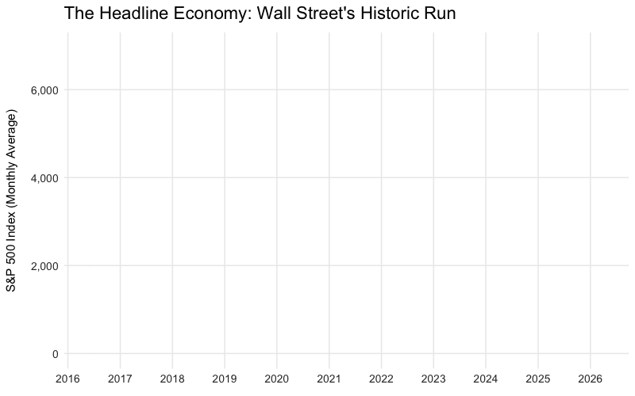

```{r setup}
#| echo: false
#| warning: false
#| message: false

library(tidyverse)
library(janitor)
library(scales)
library(readxl)
library(lubridate)
library(plotly)
library(gganimate)

# load and clean data
stocks <- read_csv("SP500.csv") |>
  # this makes column names lowercase
  clean_names() 

# process data for monthly averages from 2016 onward
sp500_monthly <- stocks |>
  mutate(observation_date = as.Date(observation_date)) |>
  filter(observation_date >= "2016-01-01") |>
  # group by month
  mutate(month = floor_date(observation_date, "month")) |>
  group_by(month) |>
  summarize(avg_close = mean(sp500, na.rm = TRUE))


# load and clean data
cpi_data <- read_csv("CPIAUCSL_PC1_1.csv") |>
  clean_names() |>
  mutate(observation_date = as.Date(observation_date)) |>
  filter(observation_date >= "2016-01-01") |>
  # CSV has numbers like 1.23 for 1.23%, divide by 100 so scales::percent() formats it
  mutate(inflation_rate = cpiaucsl_pc1 / 100)


raw_bls <- read_excel("cu-income-quintiles-before-taxes-2024 (1).xlsx", skip = 2) 

# rename columns to be more code friendly
names(raw_bls) <- c("category", "all_units", "q1_lowest", "q2", "q3", "q4", "q5_highest")

# this creates a new column with the actual item name, and pulls it down to align with the mean data rows
clean_bls <- raw_bls |>
  mutate(
    # these are the main category headers 
    main_item = if_else(!category %in% c("Mean", "SE", "Share", "RSE", "Lower limit", NA), 
                        str_trim(category), 
                        NA_character_)
  ) |>
  fill(main_item, .direction = "down") |>
  # filter for average dollar amounts
  filter(category == "Mean") |>
  select(-category) |> 
  relocate(main_item)


# extract Absolute Expenditures (Food, Housing, Other)
necessities_abs <- clean_bls |>
  filter(main_item %in% c("Food", "Housing")) |>
  pivot_longer(cols = q1_lowest:q5_highest, names_to = "quintile", values_to = "amount") |>
  mutate(amount = as.numeric(amount))

expenditure_totals <- clean_bls |>
  filter(main_item == "Average annual expenditures") |>
  pivot_longer(cols = q1_lowest:q5_highest, names_to = "quintile", values_to = "total_expenditures") |>
  mutate(total_expenditures = as.numeric(total_expenditures))

other_abs <- necessities_abs |>
  group_by(quintile) |>
  summarize(necessity_total = sum(amount), .groups = "drop") |>
  left_join(expenditure_totals, by = "quintile") |>
  mutate(
    main_item = "Other",
    amount = total_expenditures - necessity_total
  ) |>
  select(quintile, main_item, amount)

anim_expenditures <- bind_rows(
  necessities_abs |> select(quintile, main_item, amount),
  other_abs
) |>
  mutate(
    quintile = factor(quintile, levels = c("q1_lowest", "q2", "q3", "q4", "q5_highest")),
    main_item = factor(main_item, levels = c("Other", "Food", "Housing"))
  )

# extract Income Before Taxes
anim_income <- clean_bls |>
  filter(main_item == "Income before taxes") |> 
  pivot_longer(cols = q1_lowest:q5_highest, names_to = "quintile", values_to = "income") |>
  mutate(
    income = as.numeric(income),
    quintile = factor(quintile, levels = c("q1_lowest", "q2", "q3", "q4", "q5_highest"))
  )

# prepare data for labels
label_data <- anim_income |>
  left_join(
    anim_expenditures |> group_by(quintile) |> summarize(total_exp = sum(amount)), 
    by = "quintile"
  ) |>
  mutate(bracket_num = as.numeric(quintile))

# base plot, bars only
# We use as.numeric(quintile) for the x-axis so we can seamlessly pan across it
survival_bars_only <- ggplot(anim_expenditures, aes(x = as.numeric(quintile), y = amount)) +
  geom_col(aes(fill = main_item), position = "stack", width = 0.6) +
  scale_fill_manual(
    values = c("Other" = "#f2f2f2", "Food" = "#e63946", "Housing" = "#1d3557")
  ) +
  scale_x_continuous(
    breaks = 1:5, 
    labels = c("Lowest 20%", "Second 20%", "Third 20%", "Fourth 20%", "Highest 20%")
  ) +
  scale_y_continuous(labels = dollar_format()) +
  labs(
    title = "Expenses on Necesities vs. Income",
    x = "",
    y = "Absolute Dollars",
    fill = "Expenditure Category",
    color = "" # we will name the color legend scale directly below
  ) +
  theme_minimal() +
  theme(
    legend.position = "right",
    plot.title = element_text(face = "bold", size = 16),
    panel.grid.major.x = element_blank()
  )

# full plot with income lines
# by mapping color inside aes(), it forces a legend entry for the yellow line
survival_full <- survival_bars_only +
  geom_segment(
    data = anim_income,
    aes(
      x = as.numeric(quintile) - 0.45, 
      xend = as.numeric(quintile) + 0.45, 
      y = income, 
      yend = income,
      color = "Mean Income Bracket" # This text becomes the legend label
    ),
    linewidth = 1.5
  ) +
  scale_color_manual(values = c("Mean Income Bracket" = "#FFD700"))

# create 6 animation states

# state 2: Zoomed on Q1, Reveal Line and Numbers
state_q1_full <- survival_full +
  geom_text(data = filter(label_data, bracket_num == 1), aes(x = bracket_num, y = total_exp, label = paste("Spent:", dollar(total_exp))), fontface = "bold", vjust = -1) +
  geom_text(data = filter(label_data, bracket_num == 1), aes(x = bracket_num, y = income, label = paste("Earned:", dollar(income))), color = "#FFD700", fontface = "bold", vjust = 1.5) +
  coord_cartesian(xlim = c(0.6, 1.4), ylim = c(0, 45000))

# state 3: Pan to Q2, Reveal Line and Numbers
state_q2_full <- survival_full +
  geom_text(data = filter(label_data, bracket_num == 2), aes(x = bracket_num, y = total_exp, label = paste("Spent:", dollar(total_exp))), fontface = "bold", vjust = -1) +
  geom_text(data = filter(label_data, bracket_num == 2), aes(x = bracket_num, y = income, label = paste("Earned:", dollar(income))), color = "black", fontface = "bold", vjust = 1.5) +
  coord_cartesian(xlim = c(1.6, 2.4), ylim = c(0, 75000))

# state 4: Pan to Q3, Reveal Line and Numbers
state_q3_full <- survival_full +
  geom_text(data = filter(label_data, bracket_num == 3), aes(x = bracket_num, y = total_exp, label = paste("Spent:", dollar(total_exp))), fontface = "bold", vjust = -1) +
  geom_text(data = filter(label_data, bracket_num == 3), aes(x = bracket_num, y = income, label = paste("Earned:", dollar(income))), color = "#FFD700", fontface = "bold", vjust = -1) +
  coord_cartesian(xlim = c(2.6, 3.4), ylim = c(0, 110000))

# state 5: Pan to Q4, Reveal Line and Numbers
state_q4_full <- survival_full +
  geom_text(data = filter(label_data, bracket_num == 4), aes(x = bracket_num, y = total_exp, label = paste("Spent:", dollar(total_exp))), fontface = "bold", vjust = -1) +
  geom_text(data = filter(label_data, bracket_num == 4), aes(x = bracket_num, y = income, label = paste("Earned:", dollar(income))), color = "#FFD700", fontface = "bold", vjust = -1) +
  coord_cartesian(xlim = c(3.6, 4.4), ylim = c(0, 160000))

# state 6: Pan to Q5, Reveal Line and Numbers (Notice the massive Y-axis jump)
state_q5_full <- survival_full +
  geom_text(data = filter(label_data, bracket_num == 5), aes(x = bracket_num, y = total_exp, label = paste("Spent:", dollar(total_exp))), fontface = "bold", vjust = -1) +
  geom_text(data = filter(label_data, bracket_num == 5), aes(x = bracket_num, y = income, label = paste("Earned:", dollar(income))), color = "#FFD700", fontface = "bold", vjust = -1) +
  coord_cartesian(xlim = c(4.6, 5.4), ylim = c(0, 320000))

# state 7: Zoom Out, All Brackets, No Numbers
state_all_clean <- survival_full + 
  coord_cartesian(xlim = c(0.5, 5.5))

# load and clean the Fed data
dfa_raw <- read_csv("dfa-networth-levels.csv") |> 
  clean_names()

# process and group the Data
wealth_data <- dfa_raw |>
  mutate(date = yq(date)) |>
  filter(date >= "2016-01-01") |>
  mutate(
    narrative_group = case_when(
      category %in% c("TopPt1", "RemainingTop1", "Next9") ~ "The Top 10%",
      category == "Next40" ~ "The Middle 40%",
      category == "Bottom50" ~ "The Bottom 50%"
    )
  ) |>
  group_by(date, narrative_group) |>
  summarize(total_net_worth = sum(net_worth, na.rm = TRUE), .groups = "drop") |>
  mutate(net_worth_trillions = total_net_worth / 1000000) |>
  mutate(narrative_group = factor(narrative_group, levels = c("The Top 10%", "The Middle 40%", "The Bottom 50%"))) |>
  mutate(
    hover_label = paste0(
      narrative_group, "\n",
      "Date: ", format(date, "%b %Y"), "\n",
      "Net Worth: ", dollar(net_worth_trillions, suffix = "T")
    )
  )


k_shape_base <- ggplot(wealth_data, aes(x = date, y = net_worth_trillions, color = narrative_group, text = hover_label, group = narrative_group)) +
  scale_y_continuous(labels = dollar_format(suffix = "T"), limits = c(0, 160)) +
  scale_x_date(date_breaks = "1 year", date_labels = "%Y", limits = as.Date(c("2016-01-01", "2024-01-01"))) +
  scale_color_manual(
    values = c(
      "The Top 10%" = "#9DC1FF",     
      "The Middle 40%" = "#FAA613",  
      "The Bottom 50%" = "#e74c3c"   
    )
  ) +
  labs(
    title = "The K-Shaped Economy: The Great Wealth Divide",
    x = "",
    y = "Total Net Worth (Trillions of Dollars)",
    color = "Wealth Group"
  ) +
  theme_minimal() +
  theme(
    legend.position = "bottom",
    plot.title = element_text(face = "bold", size = 14),
    panel.grid.minor = element_blank()
  )

k_state_1 <- k_shape_base + 
  geom_line(data = filter(wealth_data, narrative_group == "The Top 10%"), linewidth = 1)

k_state_2 <- k_shape_base + 
  geom_line(data = filter(wealth_data, narrative_group %in% c("The Top 10%", "The Middle 40%")), linewidth = 1)

k_state_3 <- k_shape_base + 
  geom_line(linewidth = 1)

k_shape_plot <- k_shape_base + geom_line(linewidth = 1)

# convert to an Interactive plotly widget
# tell it to strictly use the custom 'hover_label' for the tooltip
interactive_plot <- ggplotly(k_shape_plot, tooltip = "text") |>
  # subtitles through layout
  layout(
    hovermode = "x unified", 
    margin = list(t = 70) 
  )

```


## Part 1: The Headline Economy

:::{.cr-section}

If we judge the health of the economy purely by the stock market, we are living in a historic golden age. [@cr-sp500]

Since 2016, despite a brief, sharp drop during the early days of the global pandemic, the S&P 500 has surged to record breaking heights. This upward trajectory dominates media and financial headlines, driving the narrative of a robust, thriving American economy. [@cr-sp500]

But the stock market is not the economy. And for a vast portion of Americans, this massive generation of wealth is happening entirely out of reach. [@cr-sp500]

:::{#cr-sp500}

``` {r}
#| echo: false
#| warning: false
#| message: false

#library(tidyverse)
#library(janitor)
#library(scales)
#library(lubridate)
#library(gganimate)

# Temp code to create gif in console
stocks <- read_csv("SP500.csv") |> clean_names() 
sp500_monthly <- stocks |>
    mutate(observation_date = as.Date(observation_date)) |>
    filter(observation_date >= "2016-01-01") |>
    mutate(month = floor_date(observation_date, "month")) |>
    group_by(month) |>
    summarize(avg_close = mean(sp500, na.rm = TRUE))

# build plot
sp500_plot <- ggplot(sp500_monthly, aes(x = month, y = avg_close)) +
    geom_ribbon(aes(ymin = 0, ymax = avg_close), fill = "#9DC1FF", alpha = 0.2) + 
    geom_line(color = "#8F95EB", linewidth = 1.2) +
    scale_y_continuous(labels = comma_format()) +
    scale_x_date(date_breaks = "1 year", date_labels = "%Y") +
    labs(
        title = "The Headline Economy: Wall Street's Historic Run",
        x = "",
        y = "S&P 500 Index (Monthly Average)"
    ) +
    theme_minimal() +
    theme(
        plot.title = element_text(face = "bold", size = 16),
        plot.subtitle = element_text(color = "#555555", size = 11, margin = margin(b = 15)),
        panel.grid.minor = element_blank(),
        axis.text = element_text(size = 10, color = "#333333"),
        axis.title.y = element_text(margin = margin(r = 10))
    ) +
    transition_reveal(month)

# create animation object
#final_gif <- animate(sp500_plot, fps = 20, duration = 8, end_pause = 60, width = 800, height = 500, res = 100)

# save to folder
#anim_save("sp500_animated.gif", animation = final_gif)

```


:::

:::

## Part 2: The Illusion of Relief

:::{.cr-section layout="sidebar-right"}

While the stock market boomed, there was another historic event: the inflation crisis of 2021 and 2022. [@cr-cpi]

Recently, politicians and economists have celebrated because the year-over-year inflation rate has plummeted back down toward the Federal Reserve's 2% target. [@cr-cpi]{pan-to="-40%,0%" scale-by="2"}

However, a falling inflation rate is a misleading metric of relief. Disinflation does not mean prices are dropping. It simply means prices are rising at a slower pace. The damage from the massive red spike in 2022 is permanently baked into the cost of everyday life. [@cr-cpi]

:::{#cr-cpi}

```{r}
#| echo: false
#| warning: false
#| fig-width: 8
#| fig-height: 5

ggplot(cpi_data, aes(x = observation_date, y = inflation_rate)) +
  
  # the Fed 2% Target (yintercept = 0.02)
  geom_hline(yintercept = 0.02, linetype = "dashed", color = "#7f8c8d", linewidth = 1) +
  
  geom_line(color = "#e74c3c", linewidth = 1.2) +
  geom_area(fill = "#e74c3c", alpha = 0.1) +
  
  # Y-axis breaks to step by 1% (0.01) from 0 to 10%
  scale_y_continuous(
    labels = percent_format(accuracy = 1),
    breaks = seq(0, 0.10, by = 0.02) 
  ) +
  scale_x_date(date_breaks = "1 year", date_labels = "%Y") +
  
  labs(
    title = "The Illusion of Relief: Inflation is Cooling Down",
    x = "",
    y = "Year-over-Year Inflation Rate"
  ) +
  
  # pushed the y-coordinate for the label slightly higher (0.023) so it rests above the line
  annotate("text", x = as.Date("2016-02-01"), y = 0.023, label = "Fed 2% Target", color = "#7f8c8d", fontface = "bold", hjust = 0.05) +
  
  theme_minimal() +
  theme(
    plot.title = element_text(face = "bold", size = 16),
    plot.subtitle = element_text(color = "#555555", size = 11, margin = margin(b = 15), lineheight = 1.2),
    panel.grid.minor = element_blank(),
    axis.text = element_text(size = 10, color = "#333333"),
    axis.title.y = element_text(margin = margin(r = 10)),
    plot.margin = margin(t = 20, r = 20, b = 10, l = 10) 
  )
```

:::
:::

## Part 3: How We Feel Inflation

:::{.cr-section layout="sidebar-left"}

Let's zoom in on the lowest 20% of earners to start seeing how people in different income brackets feel inflation by how much they have to spend on necessities. [@cr-spend-q1]

When we reveal their mean income, the severity of the crisis becomes clear. This group faces a harsh deficit, they are forced to spend thousands of dollars more than they earn, taking on debt just to afford housing and food. 

As we pan to the second-lowest 20% of earners, the gap closes, but the margin for error remains very thin. Almost their entire income is consumed by basic necessities. [@cr-spend-q2]

For the middle 20%, we finally see a surplus begin to form, allowing for a modest amount of savings and discretionary spending. [@cr-spend-q3]

By the fourth bracket, discretionary income expands significantly. They are largely shielded from spikes in the cost of gas or groceries. [@cr-spend-q4]

And for the highest 20% of earners, basic survival necessities represent only a tiny fraction of a massive income pool. [@cr-spend-q5]

When we clear the numbers and zoom out to view the entire economy, the reality of the wealth gap becomes undeniable. The bottom end is structurally squeezed, while the top has a massive surplus to invest. [@cr-spend-all]


:::{#cr-spend-q1}

```{r}
#| echo: false
#| warning: false
#| fig-width: 8
#| fig-height: 5
state_q1_full
```

:::

:::{#cr-spend-q2}

```{r}
#| echo: false
#| warning: false
#| fig-width: 8
#| fig-height: 5

state_q2_full

```
:::

:::{#cr-spend-q3}
```{r}
#| echo: false
#| warning: false
#| fig-width: 8
#| fig-height: 5

state_q3_full
```
:::

:::{#cr-spend-q4}

```{r}
#| echo: false
#| warning: false
#| fig-width: 8
#| fig-height: 5
state_q4_full
```
:::

:::{#cr-spend-q5}

```{r}
#| echo: false
#| warning: false
#| fig-width: 8
#| fig-height: 5
state_q5_full
```
:::

:::{#cr-spend-all}

```{r}
#| echo: false
#| warning: false
#| fig-width: 8
#| fig-height: 5
state_all_clean
```
:::

:::


## Part 4: The Wealth Gap

::::{.cr-section layout="sidebar-right"}

When we combine these booming stock and asset prices with overwhelming costs on necessities, we get a "K-Shaped" economy. [@cr-wealth-1]

Let's look at who actually owns America's wealth. Since 2016, the top 10% of earners, who hold the vast majority of stocks and real estate, have seen their total net worth explode exponentially. [@cr-wealth-1]

What about the traditional middle class? The middle 40% has seen some growth, primarily driven by home equity, but their trajectory is flat compared to the gains at the top. [@cr-wealth-2]

But the most alarming reality belongs to the bottom 50% of Americans. [@cr-wealth-3]

Because the bottom 50% must spend most their entire budget to survive, they cannot invest. Therefore, the wealth of the bottom 50% flatlines entirely against the bottom of the axis. Two Americas, living in the same country, experiencing entirely different economies. [@cr-wealth-3]

Hover over the lines to explore the exact wealth gap. [@cr-wealth-interactive]

:::{#cr-wealth-1}

```{r}
#| echo: false
#| warning: false
#| fig-width: 8
#| fig-height: 5
k_state_1
```

:::

:::{#cr-wealth-2}

```{r}
#| echo: false
#| warning: false
#| fig-width: 8
#| fig-height: 5
k_state_2
```

:::

:::{#cr-wealth-3}

```{r}
#| echo: false
#| warning: false
#| fig-width: 8
#| fig-height: 5
k_state_3
```

:::

:::{#cr-wealth-interactive}

```{r}
#| echo: false
#| warning: false
#| fig-width: 8
#| fig-height: 5
interactive_plot
```

:::

:::

## Links

:::{.offlinks}
[Data Sources and Site Details](data.html)

:::